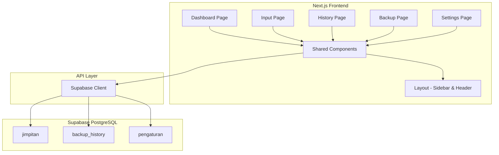
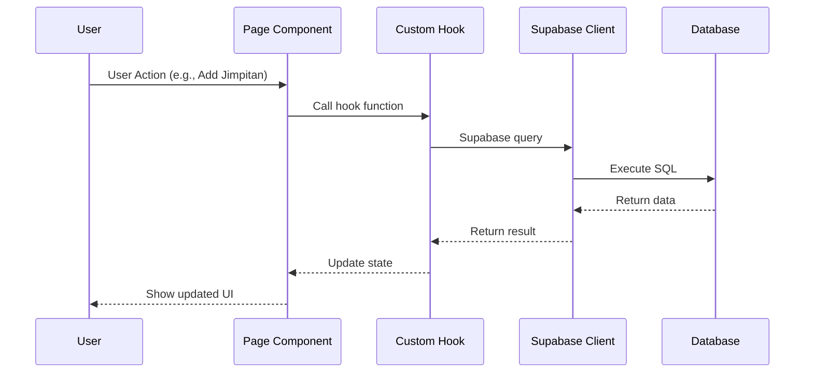

# Jimpitan RT/RW Application - Implementation Plan

## 📋 Project Overview

A web-based application for managing jimpitan (community contribution) collections for RT/RW neighborhoods. The application allows users to track daily/weekly contributions, view history, manage backups, and configure settings.

## 🛠️ Technology Stack

| Component | Technology | Description |
|-----------|-----------|-------------|
| **Frontend** | Next.js 14 | React framework with App Router |
| **Language** | TypeScript | Type-safe development |
| **UI Library** | Tailwind CSS | Utility-first CSS framework |
| **Icons** | Lucide React | Modern icon library |
| **Charts** | Recharts | Data visualization |
| **Database** | Supabase PostgreSQL | Backend-as-a-Service |
| **ORM** | Supabase Client SDK | Type-safe database client |

## 🏗️ System Architecture



## 📊 Database Schema (Simplified)

Based on the UI requirements, we'll use a simplified schema:

### 1. `jimpitan` - Jimpitan Collections
```sql
CREATE TABLE jimpitan (
    id UUID PRIMARY KEY DEFAULT uuid_generate_v4(),
    amount INTEGER NOT NULL CHECK (amount > 0),
    collection_date DATE NOT NULL,
    week_number INTEGER,
    month INTEGER,
    year INTEGER,
    notes TEXT,
    created_at TIMESTAMPTZ DEFAULT NOW()
);

CREATE INDEX idx_jimpitan_date ON jimpitan(collection_date DESC);
CREATE INDEX idx_jimpitan_month_year ON jimpitan(month, year);
```

### 2. `backup_history` - Backup Records
```sql
CREATE TABLE backup_history (
    id UUID PRIMARY KEY DEFAULT uuid_generate_v4(),
    backup_name VARCHAR(255) NOT NULL,
    created_at TIMESTAMPTZ DEFAULT NOW(),
    restored_at TIMESTAMPTZ
);
```

### 3. `pengaturan` - App Settings
```sql
CREATE TABLE pengaturan (
    id UUID PRIMARY KEY DEFAULT uuid_generate_v4(),
    key VARCHAR(100) UNIQUE NOT NULL,
    value TEXT NOT NULL,
    updated_at TIMESTAMPTZ DEFAULT NOW()
);

-- Default settings
INSERT INTO pengaturan (key, value) VALUES
    ('app_name', 'Jimpitan RT 05'),
    ('nominal_default', '5000'),
    ('theme', 'light');
```

## 📁 Project Structure

```
jimpitan-rt-rw/
├── app/
│   ├── api/
│   │   ├── jimpitan/
│   │   │   ├── route.ts          # CRUD operations for jimpitan
│   │   │   └── [id]/
│   │   │       └── route.ts      # Delete operation
│   │   ├── backup/
│   │   │   ├── route.ts          # Create backup
│   │   │   └── [id]/
│   │   │       └── route.ts      # Restore backup
│   │   └── settings/
│   │       └── route.ts          # Get/Update settings
│   ├── dashboard/
│   │   └── page.tsx              # Dashboard page
│   ├── input/
│   │   └── page.tsx              # Input jimpitan page
│   ├── riwayat/
│   │   └── page.tsx              # History page
│   ├── backup/
│   │   └── page.tsx              # Backup page
│   ├── settings/
│   │   └── page.tsx              # Settings page
│   ├── layout.tsx                # Root layout
│   ├── page.tsx                  # Home page (redirect to dashboard)
│   └── globals.css               # Global styles
├── components/
│   ├── layout/
│   │   ├── Sidebar.tsx           # Sidebar navigation
│   │   └── Header.tsx           # Header with theme toggle
│   ├── dashboard/
│   │   ├── StatCard.tsx          # Statistics card component
│   │   └── WeeklyChart.tsx       # Weekly chart component
│   ├── ui/
│   │   ├── Button.tsx            # Button component
│   │   ├── Input.tsx             # Input component
│   │   ├── Select.tsx            # Select component
│   │   └── Table.tsx             # Table component
│   └── providers/
│       ├── ThemeProvider.tsx     # Dark mode provider
│       └── SupabaseProvider.tsx  # Supabase client provider
├── lib/
│   ├── supabase/
│   │   ├── client.ts             # Supabase client initialization
│   │   └── types.ts              # TypeScript types
│   ├── utils/
│   │   ├── format.ts             # Format utilities (rupiah, date)
│   │   └── validation.ts         # Form validation
│   └── constants.ts              # App constants
├── hooks/
│   ├── useTheme.ts               # Dark mode hook
│   ├── useJimpitan.ts            # Jimpitan data hook
│   └── useBackup.ts              # Backup data hook
├── public/
│   └── images/                   # Static assets
├── supabase/
│   ├── migrations/
│   │   ├── 001_initial_schema.sql
│   │   ├── 002_seed_data.sql
│   │   └── 003_rls_policies.sql
│   └── seed.sql                  # Seed data
├── .env.local                    # Environment variables
├── .gitignore
├── next.config.js
├── package.json
├── tailwind.config.ts
└── tsconfig.json
```

## 🔄 Data Flow



## 📄 Page Breakdown

### 1. Dashboard (`/dashboard`)
- **Features:**
  - Statistics cards (Total, This Month, Today)
  - Weekly line chart
  - Recent entries list
- **Components:**
  - `StatCard` - Display statistics with icon
  - `WeeklyChart` - Recharts line chart
  - `RecentEntries` - List of latest entries

### 2. Input Jimpitan (`/input`)
- **Features:**
  - Form to add new jimpitan entry
  - Fields: Amount, Date, Notes
  - Recent entries preview
- **Validation:**
  - Amount must be positive
  - Date is required
  - Notes is optional

### 3. Riwayat (`/riwayat`)
- **Features:**
  - Table with all entries
  - Filter by month and year
  - Pagination (5 items per page)
  - Delete entry action
- **Components:**
  - Filter controls (Month/Year dropdowns)
  - Data table
  - Pagination controls

### 4. Backup (`/backup`)
- **Features:**
  - Create new backup
  - List all backups
  - Restore from backup
  - Download backup file

### 5. Settings (`/settings`)
- **Features:**
  - App name configuration
  - Default nominal setting
  - Theme preference
  - Other app settings

## 🎨 UI Design Guidelines

### Color Scheme
- **Primary:** Blue-500 (#3b82f6)
- **Success:** Green-500 (#22c55e)
- **Warning:** Yellow-500 (#eab308)
- **Danger:** Red-500 (#ef4444)
- **Dark Mode:** Gray-900 background, Gray-800 cards

### Typography
- **Font:** Inter (default Tailwind)
- **Headings:** Bold, large sizes
- **Body:** Regular, medium sizes
- **Captions:** Small, muted colors

### Components
- **Cards:** Rounded-2xl, shadow-lg, hover:shadow-xl
- **Buttons:** Gradient backgrounds, rounded-xl
- **Inputs:** Rounded-xl, focus rings
- **Tables:** Clean borders, hover effects

## 🔐 Security Considerations

1. **Row Level Security (RLS):** Enable on all tables
2. **API Keys:** Store in environment variables
3. **Input Validation:** Server-side validation
4. **SQL Injection:** Use parameterized queries (Supabase handles this)
5. **CORS:** Configure allowed origins

## 📦 Dependencies

```json
{
  "dependencies": {
    "next": "14.x",
    "react": "^18.x",
    "react-dom": "^18.x",
    "@supabase/supabase-js": "^2.x",
    "lucide-react": "^0.x",
    "recharts": "^2.x",
    "clsx": "^2.x",
    "tailwind-merge": "^2.x"
  },
  "devDependencies": {
    "@types/node": "^20.x",
    "@types/react": "^18.x",
    "@types/react-dom": "^18.x",
    "typescript": "^5.x",
    "tailwindcss": "^3.x",
    "postcss": "^8.x",
    "autoprefixer": "^10.x"
  }
}
```

## 🚀 Implementation Steps

### Phase 1: Project Setup
1. Initialize Next.js project with TypeScript
2. Configure Tailwind CSS
3. Install dependencies
4. Set up Supabase project
5. Configure environment variables

### Phase 2: Database Setup
1. Create Supabase tables
2. Set up RLS policies
3. Create indexes
4. Seed initial data

### Phase 3: Core Components
1. Create base layout (Sidebar + Header)
2. Implement theme provider
3. Create shared UI components
4. Set up Supabase client

### Phase 4: Page Implementation
1. Dashboard page
2. Input page
3. History page
4. Backup page
5. Settings page

### Phase 5: API Integration
1. Create API routes
2. Implement CRUD operations
3. Add error handling
4. Implement optimistic updates

### Phase 6: Polish & Testing
1. Responsive design
2. Loading states
3. Error states
4. Form validation
5. End-to-end testing

## 📝 Notes

- The UI example uses local state, but the production app will use Supabase for persistence
- All currency values are stored as integers (Rupiah, no decimals)
- Dates are stored as DATE type, timestamps as TIMESTAMPTZ
- Dark mode is persisted in localStorage
- Responsive design prioritizes mobile-first approach
