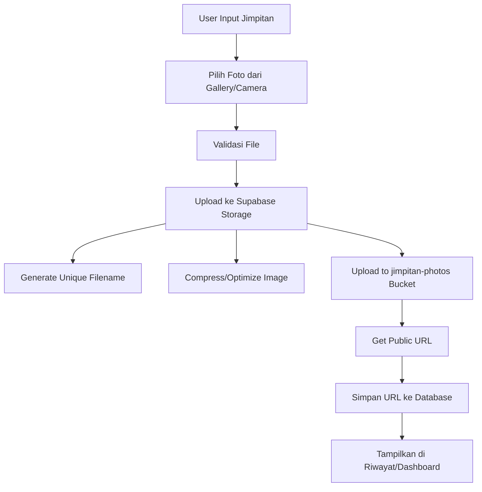

# Rencana Implementasi Fitur Upload Foto Jimpitan

## Overview
Menambahkan fitur untuk mengupload dan menyimpan foto sebagai bukti saat input jimpitan. Foto akan diambil dari storage internal device (gallery/camera) dan disimpan di Supabase Storage.

## Arsitektur Solusi



## Database Changes

### 1. Migration: Tambah kolom photo_url
**File:** `supabase/migrations/006_add_photo_url_column.sql`

```sql
-- Add photo_url column to jimpitan table
ALTER TABLE jimpitan 
ADD COLUMN photo_url TEXT;

-- Add index for better query performance
CREATE INDEX idx_jimpitan_photo ON jimpitan(photo_url) WHERE photo_url IS NOT NULL;
```

### 2. Storage Bucket Setup
**Manual Setup di Supabase Dashboard:**
- Buat bucket baru: `jimpitan-photos`
- Set bucket sebagai public atau dengan signed URL
- Konfigurasi RLS policies untuk bucket

### 3. RLS Policies for Storage
**File:** `supabase/migrations/007_storage_policies.sql`

```sql
-- Create storage policies for jimpitan-photos bucket

-- Allow public read access to photos
CREATE POLICY "Public photos are viewable by everyone"
ON storage.objects FOR SELECT
TO public
USING (bucket_id = 'jimpitan-photos');

-- Allow authenticated users to upload photos
CREATE POLICY "Authenticated users can upload photos"
ON storage.objects FOR INSERT
TO authenticated
WITH CHECK (bucket_id = 'jimpitan-photos');

-- Allow users to delete their own photos
CREATE POLICY "Users can delete their own photos"
ON storage.objects FOR DELETE
TO authenticated
USING (bucket_id = 'jimpitan-photos');
```

## Type Definitions

### Update File: `lib/supabase/types.ts`

```typescript
export interface Jimpitan {
  id: string;
  amount: number;
  collection_date: string;
  week_number: number | null;
  month: number | null;
  year: number | null;
  notes: string | null;
  photo_url: string | null;  // NEW
  created_at: string;
}

export interface CreateJimpitanInput {
  amount: number;
  collection_date: string;
  notes?: string;
  photo?: File | null;  // NEW - File object for upload
}

export interface UpdateJimpitanInput {
  amount?: number;
  collection_date?: string;
  notes?: string;
  photo_url?: string | null;  // NEW
}
```

## Utility Functions

### Create File: `lib/supabase/storage.ts`

```typescript
import { supabase } from './client';

const BUCKET_NAME = 'jimpitan-photos';

/**
 * Upload photo to Supabase Storage
 * @param file - File object to upload
 * @param jimpitanId - ID of the jimpitan record
 * @returns Public URL of the uploaded photo
 */
export async function uploadJimpitanPhoto(
  file: File,
  jimpitanId: string
): Promise<{ success: boolean; url?: string; error?: string }> {
  try {
    // Validate file type
    const allowedTypes = ['image/jpeg', 'image/jpg', 'image/png', 'image/webp'];
    if (!allowedTypes.includes(file.type)) {
      return { 
        success: false, 
        error: 'Format file tidak didukung. Gunakan JPG, PNG, atau WebP.' 
      };
    }

    // Validate file size (max 5MB)
    const maxSize = 5 * 1024 * 1024; // 5MB
    if (file.size > maxSize) {
      return { 
        success: false, 
        error: 'Ukuran file terlalu besar. Maksimal 5MB.' 
      };
    }

    // Generate unique filename
    const fileExt = file.name.split('.').pop();
    const fileName = `${jimpitanId}_${Date.now()}.${fileExt}`;

    // Upload file
    const { data: uploadData, error: uploadError } = await supabase.storage
      .from(BUCKET_NAME)
      .upload(fileName, file, {
        cacheControl: '3600',
        upsert: false,
      });

    if (uploadError) throw uploadError;

    // Get public URL
    const { data: urlData } = supabase.storage
      .from(BUCKET_NAME)
      .getPublicUrl(fileName);

    return { success: true, url: urlData.publicUrl };
  } catch (error) {
    console.error('Error uploading photo:', error);
    return { 
      success: false, 
      error: error instanceof Error ? error.message : 'Gagal mengupload foto' 
    };
  }
}

/**
 * Delete photo from Supabase Storage
 * @param photoUrl - Public URL of the photo
 */
export async function deleteJimpitanPhoto(
  photoUrl: string
): Promise<{ success: boolean; error?: string }> {
  try {
    // Extract filename from URL
    const urlParts = photoUrl.split('/');
    const fileName = urlParts[urlParts.length - 1];

    const { error } = await supabase.storage
      .from(BUCKET_NAME)
      .remove([fileName]);

    if (error) throw error;

    return { success: true };
  } catch (error) {
    console.error('Error deleting photo:', error);
    return { 
      success: false, 
      error: error instanceof Error ? error.message : 'Gagal menghapus foto' 
    };
  }
}

/**
 * Compress image before upload (optional optimization)
 * @param file - Original file
 * @param maxWidth - Maximum width in pixels
 * @param quality - JPEG quality (0-1)
 */
export async function compressImage(
  file: File,
  maxWidth: number = 1024,
  quality: number = 0.8
): Promise<File> {
  return new Promise((resolve, reject) => {
    const img = new Image();
    const canvas = document.createElement('canvas');
    const ctx = canvas.getContext('2d');

    img.onload = () => {
      let width = img.width;
      let height = img.height;

      // Calculate new dimensions
      if (width > maxWidth) {
        height = (height * maxWidth) / width;
        width = maxWidth;
      }

      canvas.width = width;
      canvas.height = height;

      ctx?.drawImage(img, 0, 0, width, height);

      canvas.toBlob(
        (blob) => {
          if (blob) {
            const compressedFile = new File([blob], file.name, {
              type: file.type,
              lastModified: Date.now(),
            });
            resolve(compressedFile);
          } else {
            reject(new Error('Gagal mengompresi gambar'));
          }
        },
        file.type,
        quality
      );
    };

    img.onerror = () => reject(new Error('Gagal memuat gambar'));
    img.src = URL.createObjectURL(file);
  });
}
```

## Hook Updates

### Update File: `hooks/useJimpitan.ts`

```typescript
import { uploadJimpitanPhoto, deleteJimpitanPhoto } from '@/lib/supabase/storage';

export function useJimpitan() {
  // ... existing code ...

  const addJimpitan = async (input: CreateJimpitanInput) => {
    try {
      const date = new Date(input.collection_date);
      let photoUrl: string | null = null;

      // Upload photo if provided
      if (input.photo) {
        // Generate temporary ID for photo upload
        const tempId = crypto.randomUUID();
        const uploadResult = await uploadJimpitanPhoto(input.photo, tempId);
        
        if (!uploadResult.success) {
          return { 
            success: false, 
            error: uploadResult.error || 'Gagal mengupload foto' 
          };
        }
        
        photoUrl = uploadResult.url;
      }

      // Insert jimpitan record
      const { data: newJimpitan, error: insertError } = await supabase
        .from('jimpitan')
        .insert({
          amount: input.amount,
          collection_date: input.collection_date,
          week_number: getWeekNumber(date),
          month: getMonthAndYear(date).month,
          year: getMonthAndYear(date).year,
          notes: input.notes || null,
          photo_url: photoUrl,  // NEW
        })
        .select()
        .single();

      if (insertError) {
        // Delete uploaded photo if database insert fails
        if (photoUrl) {
          await deleteJimpitanPhoto(photoUrl);
        }
        throw insertError;
      }

      setData([newJimpitan, ...data]);
      return { success: true, data: newJimpitan };
    } catch (err) {
      const errorMessage = err instanceof Error ? err.message : 'Failed to add jimpitan';
      setError(errorMessage);
      return { success: false, error: errorMessage };
    }
  };

  const deleteJimpitan = async (id: string) => {
    try {
      // Get photo URL before deletion
      const itemToDelete = data.find(item => item.id === id);
      
      const { error: deleteError } = await supabase
        .from('jimpitan')
        .delete()
        .eq('id', id);

      if (deleteError) throw deleteError;

      // Delete photo from storage if exists
      if (itemToDelete?.photo_url) {
        await deleteJimpitanPhoto(itemToDelete.photo_url);
      }

      setData(data.filter(item => item.id !== id));
      return { success: true };
    } catch (err) {
      const errorMessage = err instanceof Error ? err.message : 'Failed to delete jimpitan';
      setError(errorMessage);
      return { success: false, error: errorMessage };
    }
  };

  // ... rest of existing code ...
}
```

## UI Components

### Create File: `components/ui/PhotoUpload.tsx`

```typescript
'use client';

import { useState, useRef } from 'react';
import { Upload, X, Image as ImageIcon } from 'lucide-react';

interface PhotoUploadProps {
  value: File | null;
  onChange: (file: File | null) => void;
  error?: string;
  darkMode?: boolean;
}

export function PhotoUpload({ value, onChange, error, darkMode }: PhotoUploadProps) {
  const [preview, setPreview] = useState<string | null>(null);
  const [isDragging, setIsDragging] = useState(false);
  const fileInputRef = useRef<HTMLInputElement>(null);

  const handleFileSelect = (file: File | null) => {
    if (!file) return;

    // Validate file type
    const allowedTypes = ['image/jpeg', 'image/jpg', 'image/png', 'image/webp'];
    if (!allowedTypes.includes(file.type)) {
      alert('Format file tidak didukung. Gunakan JPG, PNG, atau WebP.');
      return;
    }

    // Validate file size (max 5MB)
    const maxSize = 5 * 1024 * 1024;
    if (file.size > maxSize) {
      alert('Ukuran file terlalu besar. Maksimal 5MB.');
      return;
    }

    // Create preview
    const reader = new FileReader();
    reader.onloadend = () => {
      setPreview(reader.result as string);
    };
    reader.readAsDataURL(file);

    onChange(file);
  };

  const handleDrop = (e: React.DragEvent) => {
    e.preventDefault();
    setIsDragging(false);

    const file = e.dataTransfer.files[0];
    handleFileSelect(file);
  };

  const handleDragOver = (e: React.DragEvent) => {
    e.preventDefault();
    setIsDragging(true);
  };

  const handleDragLeave = () => {
    setIsDragging(false);
  };

  const handleRemove = () => {
    setPreview(null);
    onChange(null);
    if (fileInputRef.current) {
      fileInputRef.current.value = '';
    }
  };

  return (
    <div className="space-y-2">
      <label className={`block text-sm font-medium ${darkMode ? 'text-gray-300' : 'text-gray-700'}`}>
        Foto Bukti
      </label>

      {preview ? (
        <div className="relative">
          
          <button
            type="button"
            onClick={handleRemove}
            className="absolute top-2 right-2 p-2 bg-red-500 text-white rounded-full hover:bg-red-600 transition-colors"
          >
            <X size={16} />
          </button>
        </div>
      ) : (
        <div
          onDrop={handleDrop}
          onDragOver={handleDragOver}
          onDragLeave={handleDragLeave}
          onClick={() => fileInputRef.current?.click()}
          className={`
            border-2 border-dashed rounded-xl p-8 text-center cursor-pointer transition-all
            ${isDragging 
              ? 'border-blue-500 bg-blue-50 dark:bg-blue-900/20' 
              : darkMode 
                ? 'border-gray-600 hover:border-gray-500' 
                : 'border-gray-300 hover:border-gray-400'
            }
            ${error ? 'border-red-500' : ''}
          `}
        >
          <input
            ref={fileInputRef}
            type="file"
            accept="image/jpeg,image/jpg,image/png,image/webp"
            className="hidden"
            onChange={(e) => handleFileSelect(e.target.files?.[0] || null)}
          />
          <div className="flex flex-col items-center gap-2">
            {isDragging ? (
              <Upload className="w-8 h-8 text-blue-500" />
            ) : (
              <ImageIcon className={`w-8 h-8 ${darkMode ? 'text-gray-400' : 'text-gray-500'}`} />
            )}
            <p className={`text-sm ${darkMode ? 'text-gray-300' : 'text-gray-600'}`}>
              {isDragging ? 'Lepaskan file di sini' : 'Klik atau drag & drop foto'}
            </p>
            <p className={`text-xs ${darkMode ? 'text-gray-400' : 'text-gray-500'}`}>
              JPG, PNG, atau WebP (Maks. 5MB)
            </p>
          </div>
        </div>
      )}

      {error && (
        <p className="text-sm text-red-500">{error}</p>
      )}
    </div>
  );
}
```

### Create File: `components/ui/PhotoThumbnail.tsx`

```typescript
'use client';

import { Image as ImageIcon } from 'lucide-react';

interface PhotoThumbnailProps {
  url: string | null;
  alt?: string;
  darkMode?: boolean;
  size?: 'sm' | 'md' | 'lg';
}

export function PhotoThumbnail({ url, alt = 'Foto bukti', darkMode, size = 'sm' }: PhotoThumbnailProps) {
  const sizeClasses = {
    sm: 'w-12 h-12',
    md: 'w-16 h-16',
    lg: 'w-24 h-24',
  };

  if (!url) {
    return (
      <div className={`${sizeClasses[size]} rounded-lg flex items-center justify-center ${darkMode ? 'bg-gray-700' : 'bg-gray-200'}`}>
        <ImageIcon className={`w-6 h-6 ${darkMode ? 'text-gray-500' : 'text-gray-400'}`} />
      </div>
    );
  }

  return (
     window.open(url, '_blank')}
    />
  );
}
```

## Page Updates

### Update File: `app/input/page.tsx`

```typescript
import { PhotoUpload } from '@/components/ui/PhotoUpload';

// In formData state:
const [formData, setFormData] = useState({
  amount: '',
  collection_date: new Date().toISOString().split('T')[0],
  notes: '',
  photo: null as File | null,  // NEW
});

// In form JSX:
<PhotoUpload
  value={formData.photo}
  onChange={(file) => setFormData({ ...formData, photo: file })}
  error={errors.photo}
  darkMode={darkMode}
/>

// In reset after success:
setFormData({
  amount: '',
  collection_date: new Date().toISOString().split('T')[0],
  notes: '',
  photo: null,  // NEW
});

// In addJimpitan call:
const result = await addJimpitan({
  amount: parseInt(formData.amount, 10),
  collection_date: formData.collection_date,
  notes: formData.notes,
  photo: formData.photo,  // NEW
});
```

### Update File: `app/dashboard/page.tsx`

```typescript
import { PhotoUpload } from '@/components/ui/PhotoUpload';
import { PhotoThumbnail } from '@/components/ui/PhotoThumbnail';

// In formData state:
const [formData, setFormData] = useState({
  amount: '',
  collection_date: new Date().toISOString().split('T')[0],
  notes: '',
  photo: null as File | null,  // NEW
});

// In modal form:
<PhotoUpload
  value={formData.photo}
  onChange={(file) => setFormData({ ...formData, photo: file })}
  error={errors.photo}
  darkMode={darkMode}
/>

// In reset after success:
setFormData({
  amount: '',
  collection_date: new Date().toISOString().split('T')[0],
  notes: '',
  photo: null,  // NEW
});

// In addJimpitan call:
const result = await addJimpitan({
  amount: parseInt(formData.amount, 10),
  collection_date: formData.collection_date,
  notes: formData.notes,
  photo: formData.photo,  // NEW
});

// In recent entries display:
{recentEntries.map((item) => (
  <div key={item.id} className="flex items-center gap-4">
    <PhotoThumbnail url={item.photo_url} darkMode={darkMode} size="md" />
    <div className="flex-1">
      <p className={`font-medium ${darkMode ? 'text-white' : 'text-gray-900'}`}>
        {formatRupiah(item.amount)}
      </p>
      <p className={`text-sm ${darkMode ? 'text-gray-400' : 'text-gray-500'}`}>
        {formatShortDate(item.collection_date)} • {item.notes || '-'}
      </p>
    </div>
  </div>
))}
```

### Update File: `app/riwayat/page.tsx`

```typescript
import { PhotoThumbnail } from '@/components/ui/PhotoThumbnail';

// In table header:
<th className={`text-left py-4 px-4 font-semibold ${darkMode ? 'text-gray-300' : 'text-gray-700'}`}>
  Foto
</th>

// In table body:
<td className="py-4 px-4">
  <PhotoThumbnail url={item.photo_url} darkMode={darkMode} size="sm" />
</td>

// Update colspan for empty state:
<td colSpan={5}>
```

## Validation Updates

### Update File: `lib/utils/validation.ts`

```typescript
export function validateJimpitanInput(formData: {
  amount: string;
  collection_date: string;
  notes: string;
  photo?: File | null;
}) {
  const errors: Record<string, string> = {};

  // ... existing validation ...

  // Optional photo validation
  if (formData.photo) {
    const allowedTypes = ['image/jpeg', 'image/jpg', 'image/png', 'image/webp'];
    if (!allowedTypes.includes(formData.photo.type)) {
      errors.photo = 'Format file tidak didukung. Gunakan JPG, PNG, atau WebP.';
    }

    const maxSize = 5 * 1024 * 1024; // 5MB
    if (formData.photo.size > maxSize) {
      errors.photo = 'Ukuran file terlalu besar. Maksimal 5MB.';
    }
  }

  return {
    valid: Object.keys(errors).length === 0,
    errors,
  };
}
```

## Implementation Checklist

### Database & Storage
- [ ] Buat migration file `006_add_photo_url_column.sql`
- [ ] Eksekusi migration untuk menambah kolom `photo_url`
- [ ] Buat bucket `jimpitan-photos` di Supabase Storage
- [ ] Konfigurasi RLS policies untuk bucket storage
- [ ] Buat migration file `007_storage_policies.sql`
- [ ] Eksekusi migration untuk storage policies

### Backend Logic
- [ ] Buat file `lib/supabase/storage.ts` dengan fungsi upload/delete photo
- [ ] Update `lib/supabase/types.ts` untuk menambah field `photo_url`
- [ ] Update `hooks/useJimpitan.ts` untuk handle upload photo
- [ ] Update `lib/utils/validation.ts` untuk validasi file foto

### UI Components
- [ ] Buat komponen `components/ui/PhotoUpload.tsx`
- [ ] Buat komponen `components/ui/PhotoThumbnail.tsx`

### Page Updates
- [ ] Update `app/input/page.tsx` untuk menambahkan upload foto
- [ ] Update `app/dashboard/page.tsx` untuk menambahkan upload foto di modal
- [ ] Update `app/dashboard/page.tsx` untuk menampilkan thumbnail di recent entries
- [ ] Update `app/riwayat/page.tsx` untuk menampilkan foto di tabel

### Testing
- [ ] Test upload foto dari gallery
- [ ] Test upload foto dari camera (jika didukung)
- [ ] Test validasi format file
- [ ] Test validasi ukuran file
- [ ] Test tampilan foto di riwayat
- [ ] Test tampilan foto di dashboard
- [ ] Test hapus data jimpitan (pastikan foto juga terhapus)
- [ ] Test drag & drop functionality

## Notes

1. **Storage Configuration**: Bucket harus dikonfigurasi dengan benar di Supabase Dashboard sebelum digunakan
2. **File Size Limit**: Batas 5MB sudah cukup untuk foto bukti, bisa disesuaikan jika perlu
3. **Image Compression**: Fungsi `compressImage` bersifat opsional, bisa digunakan untuk optimasi
4. **Public URL**: Menggunakan public URL untuk kemudahan akses, bisa diganti dengan signed URL untuk keamanan lebih
5. **Error Handling**: Pastikan error handling yang baik untuk kasus upload gagal
6. **Cleanup**: Saat menghapus jimpitan, foto di storage juga harus dihapus
7. **Mobile Support**: Input type="file" dengan accept="image/*" akan memilih antara camera atau gallery di mobile

## Future Enhancements

- [ ] Fitur crop/edit foto sebelum upload
- [ ] Multiple photo upload per jimpitan
- [ ] Fitur gallery untuk melihat semua foto
- [ ] Fitur download semua foto dalam zip
- [ ] Integrasi dengan camera API untuk pengambilan foto langsung
- [ ] Watermark otomatis pada foto
- [ ] EXIF data removal untuk privasi
